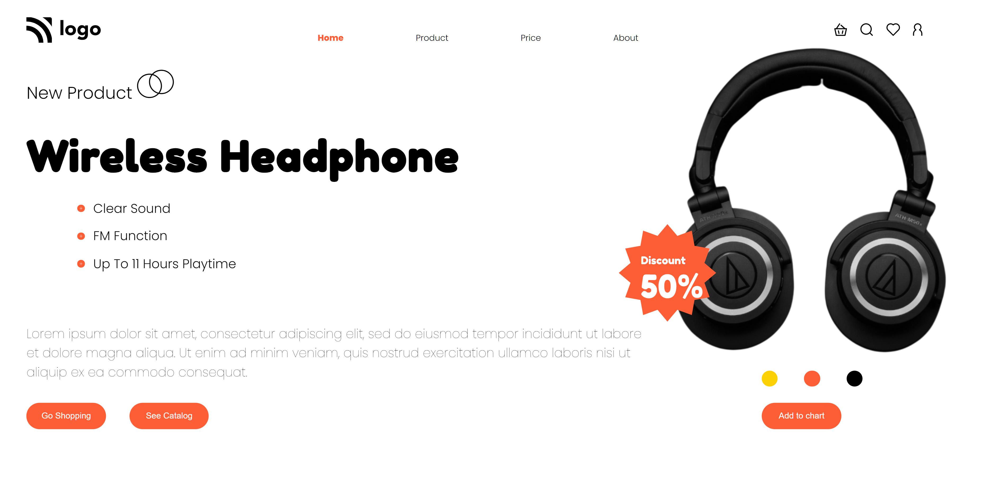
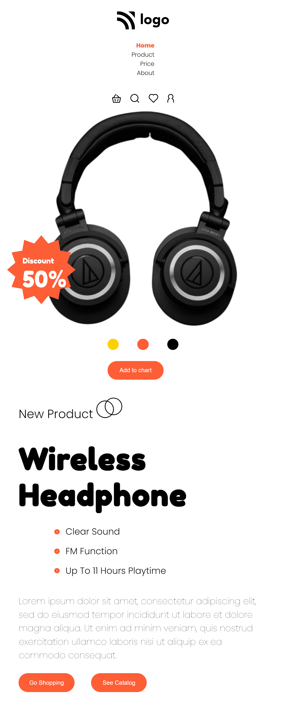
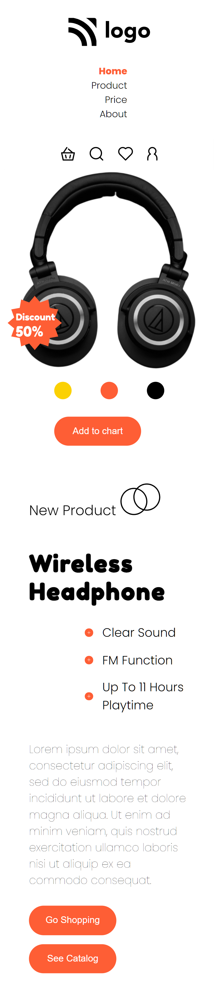

# Street style landing page
### Things I learned in this mini project
* Adding font family using Goole font link.
* Applying flexbox to div and set _"justfy-content"_ and _"align-items"_ to get desired result.
* Applying on hover effect using css.
* Applying position property such as _**relative**_ and _**absolute**_ and defining left, right, top, bottom to meet the requirement.
* Adding asset images.
* Adding border radius.
* Adding **Resposiveness** to webpage using media-query.
* Applying suitable alignment to the bigger divs to look better on small devices.

